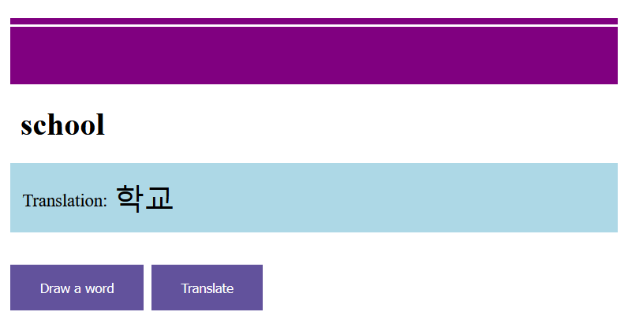

# Literally

This application ought to help you practice foreign words in the form of a quiz. It draws random words from a self-maintained dictionary.
Currently, it supports two languages: german and korean - but extended language support can be added quite easily.

### Usage

1. Build the Dockerfile.
2. Create a directory and place the dictionaries in it.
3. Run the docker container and mount the directory with the desired dictionaries in it.

#### User interface

